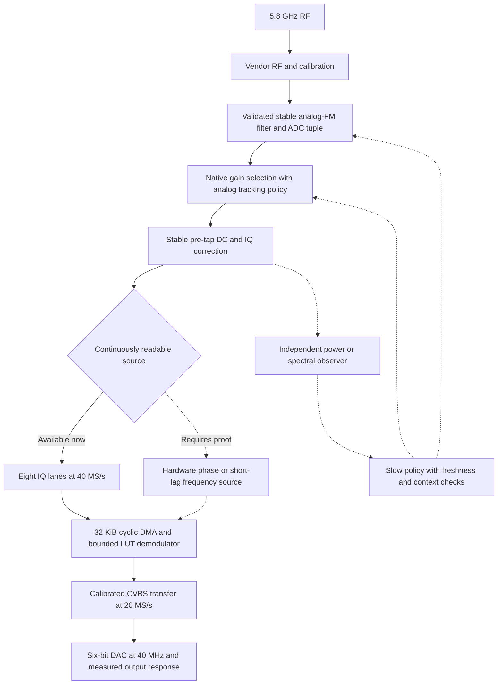

# C5-only receiver redesign: analog PHY first, continuous video second

Research date: 2026-10-01. Reviewed main:
`78a0a278a73dc98c61d02dcf96de6c48a85d14a3` (PR #129).
Related: [#134](https://github.com/Twotoz/C5VRX/issues/134),
[#135](https://github.com/Twotoz/C5VRX/issues/135),
[#121](https://github.com/Twotoz/C5VRX/issues/121).

**Recommendation:** redesign reception around a stable analog-FM PHY profile,
native hardware gain selection, a characterized pre-tap channel filter, and
the most informative continuously readable eight-lane diagnostic source.
Keep full-band 20 MS/s, six-bit composite output. Investigate a hardware
frequency/phase source before spending more precision on the same coarse IQ.
Use spectral/power hardware as an independent observer, not as an assumed
video demodulator. The existing span-75 experiment is not the selected design.

This PR contains research and a design specification only. No firmware,
generators, PHY binaries, settings, wiring or flashed images are changed.
No new hardware measurements or range gains are claimed. "Best possible"
means the strongest constrained design and a method to select its measured
winner; the available evidence cannot certify a global optimum.

## 1. Scope and the result we actually need

The primary design uses **one existing XIAO ESP32-C5, native USB, the existing
IQ/DAC pins and resistor network**. No FPGA, second receiver, external DSP,
external RF ADC, overclock or extra capture lanes are assumed. Passive output
filter changes are separately characterized options, not silently included
in a firmware-only result.

Native AGC is preferred: Espressif's hardware selects RF/BB/fine gain. Firmware
may change its validated policy or schedule tracking opportunities, but must
not secretly become a gain-index controller. Continuous native operation and
paced native operation are separate candidates. Main's current V5 policy is
a comparison reference, not the gain architecture proposed here.

The engineering objective is at least **6 dB more allowable RF attenuation
at equal full-colour picture quality**, without sacrificing close-range detail,
sync or fade recovery. This is a target, not a prediction. Under an unchanged
free-space link, 6.02 dB corresponds to approximately twice the distance;
real multipath, antenna orientation and interference do not obey that simple
mapping. A 1–2 dB gain is useful but would not satisfy the requested large step.

Report three independent outcomes: receiver sensitivity at matched quality,
strong-signal grain/false colour, and recovery after fades/overload. A softer
picture, higher RSSI, larger Q4 radius or longer display lock is insufficient
by itself.

## 2. What current evidence says

| Finding | Evidence level | Consequence |
| --- | --- | --- |
| Actual default live program is Phase8 FULL, with optional HC, and Direct Gain V5 ownership unless native is selected | Source: `start_flight_demodulator()` in [video.c](../main/video.c), [Kconfig](../main/Kconfig.projbuild), [rf.c](../main/rf.c) | Menu enum/comments saying Golden do not identify the loaded program; log the actual program and NVS |
| Native packet AGC repeatedly acquires on a continuous carrier; full-word captures show acquisition bursts and changing trapped gain | Board findings in [native-agc-v2.md](native-agc-v2.md) | Fix the acquisition mechanism before masking its samples |
| Native pacing was implemented; a later operator report described better stationary video | [native-agc-paced.md](native-agc-paced.md), [experiment research](../experiments/c5vrx-4/RESEARCH.md) | Improvement is plausible; reliable reacquisition and sensitivity remain unproved |
| Coarse Cartesian quantization can generate chroma-band tones even without RF noise | Simulation in native AGC findings | More output phase bits alone will not eliminate grain |
| Fine lanes preserve sign but fold magnitudes beyond their smaller windows | Aligned-bit findings and experiment research | Do not interpret folded fine data as ordinary signed I/Q |
| HC already exists on main and has encouraging held-out synthetic results | [range-max.md](range-max.md), [fm_hc.bsasm](../main/fm_hc.bsasm) | Reintroducing the same quadrant estimator is not a new breakthrough or measured range gain |
| MAC dump writer can run autonomously, but ordinary CPU/GDMA reads see a stale live view | [continuous-iq-findings.md](continuous-iq-findings.md) | Wider dump words cannot be assumed to feed realtime DSP |
| Existing phase-tap probe did not establish a separate phase source in the tested selector states | [probe findings](../tools/phy_phase_tap_probe.md) | A new tap is an investigation with failure criteria, not an available component |
| Initial C5VRX-4 video was reported less clean than C5VRX-3 | [experiment README](../experiments/c5vrx-4/README.md), [PR #129](https://github.com/Twotoz/C5VRX/pull/129) | Do not promote span-75 on build success or nominal resolution |

Issues #134 and #135 were read including their comment lists (both empty at
review). They broaden the search to continuous hardware observables and PHY
policy changes; their candidate symbol names do not prove working interfaces.
The historical percentage attribution in #121 is a hypothesis, not a measured
noise budget. Current hardware findings take precedence over that estimate.

## 3. Hard resource budget and what can change

The [pinned C5 capability header](https://github.com/espressif/esp-idf/blob/v6.0.2/components/soc/esp32c5/include/soc/soc_caps.h)
limits PARLIO RX to eight data bits. The
[C5 datasheet](https://documentation.espressif.com/esp32-c5_datasheet_en.html)
specifies one half-duplex BitScrambler engine, eight instructions and 2 KiB
of LUT RAM. Its RX and TX channels are not two simultaneous DSP processors.
Generic full-duplex PARLIO descriptions do not replace this repository's
physical routing/transport findings.

| Resource | Design allocation / constraint |
| --- | --- |
| Live capture | 8-bit symbol at 40 MS/s: 40 MB/s, current MODEM_DIAG/PARLIO RX |
| Raw ring | Existing 32 KiB internal SRAM; 819.2 us full wrap, approximately 409.6 us half-ring separation |
| Live DSP | TX BitScrambler, one operation bundle per measured DMA clock; current sustained shape is two bundles per 50 ns pair |
| DSP LUT | One shared 2048-byte table: 1024x16, 512x32 or 2048x8 |
| DAC transport | Byte geometry at 40 MHz, six active code bits, two identical bytes per 20 MS/s video value |
| Minimum ring traffic | 40 MB/s producer write + 40 MB/s consumer read; arbitration/descriptor traffic is additional |
| CPU | 240 MHz: six nominal CPU cycles per 40 MS/s input sample before loads, control and interrupts |
| Observer | Bounded snapshots or validated hardware registers; stale results expire, never pace RF/video |
| Runtime state | Preserved across DMA descriptors/ring wraps; reset only for real receive-context changes |

Memory capacity, input width, opcode slots, mux restrictions, LUT address
width and FIFO service rate must all pass. CPU clock is not the DSP bus clock;
80 MHz DAC packing is not twice the available LUT throughput. The general
[BitScrambler guide](https://docs.espressif.com/projects/esp-idf/en/latest/esp32c5/api-reference/peripherals/bitscrambler.html)
describes one opcode per bundle and next-bundle LUT results, but hardware
oracles govern the C5 address/mux details used here.

These constrain transport, not every future formula. Exact Golden transfer,
Phase8 format, LUT layout and legacy state encodings are not requirements.
The [Golden360 proof](golden360-feasibility.md) rejects particular exact
factorizations; it does not prove every alternative state machine impossible.

## 4. Selected system architecture

This diagram specifies desired ownership and functions, **not established
physical ordering inside the PHY**. Tap position, correction/filter placement
and accessible internal routes must be measured. Two realizations share this
architecture:

1. **IQ realization:** fits known input/streaming resources now; improves the
   input geometry and static demodulation within the existing rate budget.
2. **Hardware-demod realization:** preferred research upside on the same C5,
   conditional on finding a suitably fast continuous phase/frequency source.
   It can bypass information loss at Q4 and free a LUT stage.

The first is the implementable design target; the second is the route worth
investigating before claiming the existing LUT is the hardware's ceiling.

### Fixed design contract for the preferred IQ pipeline

The selected first receiver design is **native analog PHY + calibrated
history-conditioned cell decoder + calibrated pair discriminator**, not
span-75 and not an unspecified collection of demodulators. Golden, existing
HC and Phase8 are the reference instruments used to judge that design.

Its data contract is:

1. Vendor initialization owns RF calibration. A channel-specific, validated
   ADC/filter tuple and correction state remain fixed while tracking.
2. Native hardware owns every gain choice. The preferred policy holds a
   successfully acquired state and reacquires on a validated envelope event;
   paced native opportunities are the fallback research mechanism when no
   such hardware policy can be established. Continuous native is the control.
3. A fixed four-bit-per-axis diagnostic window captures simultaneous I/Q at
   40 MS/s. Coarse is the safe initial map; fine may be selected before the
   run only if full-word evidence validates its entire operating envelope.
4. The ring contains raw bytes in that one format. Its producer is autonomous;
   TX follows at the existing approximately half-ring separation.
5. The first lookup returns a five-bit estimated phase state from the raw
   endpoint and the previous state's quadrant. For cell region R and history
   h, derive `p(phi | R,h)` by integrating the measured quantization/noise
   likelihood over R. Choose the representable state minimizing expected
   circular phase loss, with a bounded history prior. This replaces treating
   every cell as a perfect centre point. Reliable endpoints remain unbiased.
6. The second lookup converts the signed circular state difference to the
   calibrated physical frequency/video level, then the nearest loaded DAC
   voltage. Its curve uses actual VTX polarity, deviation and known porch
   reference; it must preserve sync/burst/white and never wrap unsigned code.
   All 32x32 state pairs are defined, including improbable and noisy cases.
7. Emit `[D,D]` at 40 MHz. The display receives the recovered composite
   waveform at 20 MS/s unique values, with the measured analog output network.

The native supervisor has four explicit states: **CALIBRATE**, **ACQUIRE**,
**TRACK** and **RECOVER**. CALIBRATE restores vendor ownership for retune;
ACQUIRE lets native hardware converge; TRACK keeps the selected filter/lane/
program fixed and uses the validated native policy; RECOVER releases native
tracking immediately on a trusted overload/level event or expired acquisition
evidence. It never writes a forced gain index or guesses gain from missing
video sync. No-carrier reception must keep reacquisition possible, rather than
freezing the last low gain indefinitely. Only independently validated hardware
events may provide a fast emergency path; sparse Q4 snapshots cannot certify
a worst-case microsecond response.

The design reserves the existing 2 KiB LUT and five retained phase bits;
phase confidence is incorporated in the decoder, not added as an impossible
extra pair-address bit. It adds no realtime CPU processing or third lookup.
Offline characterization supplies immutable tables for each accepted receive
profile. Loading them during a stopped/controlled transition is separate from
writing into an active LUT. A calibrated table cannot cure winding that the
retained endpoint does not identify; the full video/CFO envelope must fit the
50 ns detector or this realization fails.

Unresolved quantities are intentionally measurement-derived: filter tuple,
native policy control, safe lane window, native target level, history prior,
frequency-to-IRE slope and loaded DAC voltages. Assigning plausible constants
to these would specify a guess instead of a better receiver. The structural
pipeline, ownership, memory, cadence and estimator objective are fixed here.

For a validated fast hardware-frequency source, replace steps 3–6 with
source-synchronous signed frequency capture and a calibrated output stage.
First determine whether the source already supplies appropriately filtered
20 MS/s video. Otherwise adjacent estimates must be filtered/reduced within
a separately proved BitScrambler schedule; there is no assumed extra engine.
That substitution leaves RF calibration, native policy, continuous transport
and output compatibility intact while removing the Cartesian-Q4 bottleneck.

## 5. Analog PHY profile: the highest-priority redesign

### 5.1 Preserve calibrated initialization; change policy narrowly

Start with vendor RF initialization and calibration. Record the actual gain
tables, ADC/filter tuple, IQ coefficients, clock state and channel. Use the
ABI findings in [arc-receive-chain.md](arc-receive-chain.md). The known
two-argument `phy_agc_max_gain_set()` is a table configuration routine, not an
arbitrary sensitivity knob. `phy_get_rx_sig_pwr()` can configure an estimator;
its name does not establish a harmless getter.

For each candidate from #135, recover argument registers, vendor callers,
MMIO writes, polling loops and calibration/packet side effects before use.
Map three different things: who programs a block, what clocks it, and which
hardware event arms/resets it. Removing a software call does not remove a
hardwired packet FSM. A binary patch cannot create new arithmetic hardware.

Use wrapper/register policy first, then a narrow ABI-compatible shim if
necessary. Only consider binary replacement after identifying the exact
harmful software instruction/control. Pin IDF, esp-phy-lib revision, archive
hash and chip revision; maintain a vendor fallback and retune restoration.
The previous audit's `libphy.a` hash is
`dbf33c418c8d408d4005c849d12a1432deea82e2e5e57de3c8ddf914d104fffb`;
verify the actual build artifact matches before relying on that audit.

### 5.2 Filter the FM channel before losing phase information

Measure vendor-valid ADC/filter/BW tuples with swept RF tones and modulated
video, including the 5830 MHz configuration boundary and both sides of the
operating range. Establish whether each setting affects the live tap, not
only packet processing or an FFT dump.

Measure normalized complex response, DC/IQ effects, group-delay variation,
output noise and equivalent noise bandwidth:

`B_ENBW = integral |H(f)|^2 df / |H(0)|^2`.

Choose the lowest ENBW that preserves wanted FM sidebands, practical CFO,
sync, PAL/NTSC chroma and detail at the agreed quality threshold. The **RF FM
channel is wider than the CVBS modulation bandwidth**. Carson's
`2*(peak deviation + highest modulation frequency)` is a starting estimate,
not a brick-wall requirement or an empirical passband measurement.

Halving measured ENBW reduces white integrated noise by 3.01 dB, provided
the wanted signal remains intact. BW20 does not automatically provide that
gain; main already contains bandwidth gear, and its tap effect remains open.
Do not present the existing gear as a newly achieved improvement. A narrow
monochrome/survival mode can be useful, but its range must be reported
separately from full-quality colour range.

### 5.3 Native gain: remove packet reacquisition, keep recovery

The desired policy is native gain selection, stable healthy reception, no
repeated packet acquisitions on stationary RF, and bounded recovery from
both strong and weak changes. Preserve RF saturation protection unless its
replacement is actually demonstrated. `phy_enable_agc()` does not undo
`phy_rfagc_disable()`; these are different control domains.

Preferred order:

1. Find a native hold/retrigger/target mechanism that retains useful tracking
   and overload response without packet abort/restart. #135 makes this a
   priority, but no such complete policy has yet been established.
2. If that fails, characterize paced BB-AGC opportunities with native gain
   selection. The existing 1000 us / 20 us gate is a baseline, not an optimum.
   Readback of gate openings is not proof of a completed acquisition.
3. Accept pacing only after proving resume, strong-to-weak and weak-to-strong
   response, adequate trapped amplitude and absence of new periodic artifacts.

For fixed period P, open window W and completion/settling time S, the adverse
case can wait nearly P before an opportunity and may require W+S afterward.
Measure actual latency and ISR lateness, not just the nominal timer. Evaluate
250/500/1000/2000 us opportunities first and the shortest windows that reliably
complete native reacquisition. A longer hold can look cleaner while receiving
a stationary VTX and fail badly in motion.

An independent validated overload/large-level event should release tracking
early; it still must not select a gain index. If no fast trustworthy event or
resume mechanism exists, long-hold pacing fails this design. Do not silently
restore V5 and continue calling it native.

Pacing explicitly differs from main's continuous-native contract because it
temporarily gates BB tracking. This is a proposed research profile, matching
the already preserved experiment; this PR changes neither that invariant nor
production defaults. A pure continuously enabled native requirement would
exclude pacing and leave a validated hardware-policy patch as the needed route.

The acquisition profile `7034[30:24]=127` is an encoded setting, not a calibrated
speed. Its effect must be isolated from pacing, IQ lanes and demodulation.
Do not guess a larger native target annulus register or interpret late BB gain
as lower RF noise figure. The generated high indices can share the same RF
stage, as documented in the receive-chain reconstruction.

### 5.4 DC/IQ correction and quantizer filling

Prefer safe vendor correction before the tap. Preserve/capture it across
channel/filter/gain context; do not run invasive RXDC/RXIQ calibration during
active video. Test residual bias on independent FM captures rather than
fitting an arbitrary ellipse to one video scene: incomplete phase coverage
and multipath can look like receiver mismatch.

Determine native trapped axis peaks and acquisition excursions from full-word
diagnostics. Choose the finest eight-lane signed window that remains valid:
coarse `{9,8,7,6}`, fine `{9,7,6,5}`, ultrafine `{9,6,5,4}` per axis represent
contiguous windows of -512..511, -256..255 and -128..127 respectively.
Outside these windows magnitude folds; observing only the fine byte cannot
uniquely distinguish all folded vectors.

Initially use a fixed lane profile for each comparison. Autonomous lane
switching needs independent coarse/overload evidence, hysteresis, generation
tags and measured GPIO-matrix transition behavior. Sequentially changing eight
routes is not an atomic per-sample format change. Neither smooth counters nor
plausible ring contents prove transition continuity. Until solved, do not make
live lane changes part of the winning receiver.

## 6. Issues #134/#135: which internal sources are actually valuable?

### 6.1 FFT and CSI: observer, not the default demodulator

Public CSI is derived from Wi-Fi training fields/received packets; analog FM
does not supply those fields. Enabling CSI or forcing LLTF dump configuration
does not establish a continuous analog source. See the
[official C5 CSI description](https://docs.espressif.com/projects/esp-idf/en/v5.5.4/esp32c5/api-guides/wifi.html#wi-fi-channel-state-information).

For the illustrative 64-point/20 MHz FFT in #134, the aperture is 3.2 us,
containing about 14.19 PAL chroma periods. Non-overlapped output is only
312.5 kHz. Updating overlapping windows faster does not remove that aperture
or reconstruct a changing FM trajectory from one spectral centroid.
Even 64 points at 40 MHz spans 1.6 us. A CW peak test is consequently not a
video-demodulation proof. Shorter FFTs trade frequency resolution for time
resolution and still need an accessible hardware schedule.

Use a validated continuous spectral source for target-vs-blocker energy,
occupied-bandwidth validation and scanning. It can inform acquisition/AFC,
but **spectral centroid is not automatically scene-independent carrier CFO**:
mean FM frequency depends on the composite waveform and emphasis. Bind AFC
to a calibrated sync-tip/back-porch reference or an independently established
carrier reference. Do not centre the receiver on a strong adjacent VTX.

### 6.2 CFO output, CFO correction and instantaneous FM are different

Investigate `phy_bb_cfo_cfg`, `phy_freq_correct` and their debug/clock/gating
paths. A correction NCO setting is an actuator value, not necessarily an
error measurement. A training-field CFO estimator can depend on known symbols
or long-lag correlation; releasing packet gating need not make it suitable
for arbitrary WBFM.

For a generic lag-T phase detector, the unambiguous constant-frequency range
is `|f| < 1/(2T)`. Illustratively, 0.8 us gives +/-625 kHz; 3.2 us gives
+/-156.25 kHz. These are conditional calculations, **not identified C5 CFO
lags**. Such outputs can be useful for acquisition but cannot directly follow
multi-MHz video deviation. Never subtract a fast tracked FM component as
"CFO": that would remove wanted video.

A candidate primary frequency source must demonstrate, on non-Wi-Fi FM:

- An aperture and modulation transfer that preserve the wanted 0–5 MHz video
  band, including PAL chroma; update rate alone is insufficient.
- At least the existing 20 MS/s useful waveform cadence or a separately proved
  reconstruction design; no packet-sized dead time or latching stale values.
- Signed span covering measured CFO plus peak deviation, documented saturation
  and ambiguity, and precision compatible with the measured six-bit CVBS step.
- A continuous eight-lane-or-less representation consumable by PARLIO at the
  proved clock, or another **physically proved** deterministic consumer.
- Correct time alignment, no mid-line hidden resets and equal-or-better output
  on sweep, noise, blockers, multipath and gain transitions.

Passing a slow-observer test does not pass these video requirements.

### 6.3 Highest-upside discovery: post-filter polar/frequency data

Prioritize a packet-independent hardware angle, short-lag frequency, or more
informative post-filter IQ source. A full-range phase byte fits the eight
capture lanes and could move Cartesian angle calculation out of BitScrambler.
This is more valuable than merely renaming FFT scaling as extra gain.

If an 8-bit phase source at 40 MS/s is found, exact two-adjacent-increment
demodulation becomes a new scheduling target:

`d[n] = wrap(phi[n] - phi[n-1])`, then
`u[k] = d[2k] + d[2k+1]` **without wrapping the sum again**.

The two-bundle budget still applies: signed delta formation, winding handling,
sum, calibrated transfer and output all need a legal schedule. Do not claim
the discovery alone provides a free filter or exact implementation. A direct
hardware frequency byte would leave fewer operations than a phase byte, but
its resolution/span/invalid metadata must be sufficient.

If only post-filter IQ is available, compare it with current IQ at equal
input, using its real source rate and bit identity. Do not capture I and Q
serially across different 25 ns instants and call them simultaneous I6/Q6.
GPIO pin availability does not remove the PARLIO eight-bit limit.

Bounded asynchronous probes shortlist taps. Promotion requires source-clocked
captures, actual non-Wi-Fi response and direct comparison against a simultaneous
reference or reproducible calibrated stimulus. The old phase-tap null result
is scoped to its tested selectors; unlimited selector sweeps are not a plan.

## 7. Concrete IQ realization within known resources

Keep the 40 MS/s ring and 20 MS/s unique output. Compare Phase8 FULL, actual
Golden Phase5 and existing HC with the **same native RF profile**, then evaluate
a calibrated two-stage estimator. Main V5 is an additional whole-receiver
reference; do not mix its RF changes into a demodulator-only comparison.

Use all eight captured bits of a retained endpoint. Derive its likelihood
from actual ADC code regions, residual correction, native amplitude/noise and
the selected lane map. A coarse signed cell s is `[64s,64s+63]`, not a symmetric
point at 64s. Fine-lane codes can correspond to multiple disjoint regions;
discarding that ambiguity in the model invents information.

The feasible history-conditioned layout is:

| Bundle | Result used | Next lookup | Stream work |
| --- | --- | --- | --- |
| Phase/pair | Current decoded 5-bit state | Previous 5-bit state + current 5-bit state | Retain current state |
| Emit/decode | Six-bit calibrated DAC code | Next raw byte + two bits of retained history | Consume 16 input bits; emit 16 `[D,D]` bits; loop |

Raw eight bits plus history two bits need 1024 decoder addresses. The state
pair also needs 1024 addresses. They share the **same** 1024x16 words with
decoder state in bits 8..12 and DAC code in bits 0..5, as in existing HC.
This is resource-feasible by that established pattern, not a newly assembled
or silicon-tested improved estimator.

Jointly evaluate state allocation, low-confidence decode and calibrated pair
mapping against a physically constrained, content-independent FM/noise model.
Do not train the output toward the mean of a favourite picture; the existing
MMSE experiment already demonstrated sync/luminance bias. High-confidence
motion, sync and chroma must retain the intended transfer. A strong temporal
prior cannot assume a universal maximum phase step without actual CFO/VTX
bounds. Quantized state errors also feed the next decoder history.

The pair lookup sees only the two five-bit states. It **does not** retain full
raw amplitude or an independent sixth confidence bit. Any confidence/state
allocation trades against phase resolution and must be scored explicitly.
This candidate is a constrained evolution of HC, not a full PLL, exact
adjacent-FM implementation or independent realtime FIR.

Search simpler alternatives before assuming two stages are optimal: a
one-bundle recurrent LUT16 can allocate 8 input bits + 2 history bits, or
6 selected input bits + 4 history bits, or 5 + 5. A word can return next state
and DAC together. Those layouts fit address/output capacity but lose either
phase history or input information. Next-cycle state dependencies and mux
rules need proof; no such estimator is claimed to match full-band quality.
Likewise LUT8 has more addresses but only eight result bits: six DAC bits
leave just two next-state bits. LUT32 has fewer addresses. These are a small
explicit design frontier, not justification to repeat a noisy IQ5 compression.

Retain a static chosen program while receiving. Runtime LUT replacement,
lane remapping or demodulator switching can corrupt state; acquisition-only
changes still need a demonstrated transition contract. No CPU ring rewrite,
sample hold guard, regenerated sync or frame decoder is selected here.

## 8. Why the preserved span-75 prototype is not the answer

Source inspection of [generate_pipeline.py](../experiments/c5vrx-4/generate_pipeline.py)
and [the emitted program](../experiments/c5vrx-4/c5vrx4_span75.bsasm) establishes
Phase6 endpoint phase, 75 ns span and `[D,D,D]` holds. Consuming three IQ
bytes is not using all three phase intervals: intermediate samples do not
resolve winding. Native pacing is a separate experimental change.

| Property | Span-50 baseline | Span-75 experiment |
| --- | ---: | ---: |
| Unique output | 20 MS/s | 13.333 MS/s |
| Endpoint frequency ambiguity | +/-10 MHz | +/-6.667 MHz |
| Phase representation | Phase8 or Phase5 | Phase6 |
| DAC hold | 50 ns | 75 ns |
| Ideal small-signal PAL chroma attenuation, detector plus hold | -1.43 dB | -3.28 dB |

The last row is a calculation: ideal unwrapped endpoint FM differentiates
phase over T, giving `sinc(fT)` frequency averaging; the zero-order DAC hold
adds another `sinc(fT)`, where `sinc(x)=sin(pi*x)/(pi*x)`. At 4.43361875 MHz,
the resulting amplitude is `sinc(fT)^2`. This continuous-time linear model
excludes LUT nonlinearities, receiver/output filters, aliases and gain events.
It is distinct from the experiment research's discrete sampled-frequency
boxcar approximation. The approximately 1.86 dB relative chroma loss is not
a measured board response, but explains why more bundles are not free quality.

Source inspection also finds that **all 64 generated DAC-map entries at
LUT[256..319] are identity**: entry i returns i. The nominal resistor inversion
currently gives no changed code sequence. A separate lookup provides future
calibration flexibility, not an existing calibrated quality improvement.

A longer span can reduce some endpoint error after scaling, but narrows
frequency headroom and changes modulation response. It is not evidence of
lower front-end noise figure, a better FM threshold or additional range.
Keep this artifact for comparison; do not build the proposed receiver around
it without a full-band controlled win.

## 9. CVBS output: calibrated transfer and actual reconstruction

Measure all 64 **loaded** steady DAC voltages and transition glitches with the
actual GPIO drive strength, resistor tolerances, ground/wiring and display
termination. Define frequency-to-video slope/polarity from measured VTX
modulation, with preserved sync tip, porch, burst and white level. Choose the
nearest appropriate measured voltage; clipping belongs outside the validated
waveform envelope, not after unsigned overflow.

A nonlinear calibrated transfer fits the existing Phase5/HC pair LUT without
an extra lookup. Full Phase8's arithmetic/top-bit program cannot be assumed
to apply an arbitrary curve at its current budget. Transfer calibration and
angle precision must therefore be compared together at equal video amplitude.

Measure video input-to-loaded-CVBS response before selecting de-emphasis,
audio traps or capacitance. [ITU-R F.405](https://www.itu.int/rec/R-REC-F.405/en)
describes a television radio-relay emphasis characteristic; it does not prove
the attached FPV VTX uses it. A fixed low-pass is not automatically matched
de-emphasis. Peaks around 6/6.5 MHz may also be Q4 harmonics, as documented in
native AGC research; identify their response to picture level/CFO before
attributing them to audio.

For ideal driven resistor branches 8200/3900/2000/1000/470/240 ohm, their
parallel source resistance is 122.36 ohm. Including the 200-ohm shunt and a
75-ohm display gives 37.73 ohm; a 470 pF shunt then has a single-pole estimate
of **8.98 MHz**, not 6.2 MHz. GPIO impedance and cabling change the result.
Such a pole is mild reconstruction, not a sharp video anti-alias filter or
removal of in-band false colour. Additional passive networks must be evaluated
for loading, level, group delay and burst/detail loss before selection.

Six-bit nominal resolution is not six-bit linearity under glitching GPIOs.
Higher output clock or smoother steps alone do not improve RF sensitivity.

## 10. Bounded investigation and winner selection

No implementation is authorized by this research document. When testing is
requested, use the following order; stop a failed branch rather than quietly
substituting a different gain owner or lower-quality video requirement.

| Stage | Deliverable | Advance condition |
| --- | --- | --- |
| Baseline | Exact running program/PHY/settings, loaded CVBS and calibrated attenuation curve | Reproducible existing quality threshold and noise/fade observations |
| PHY inventory (#135) | Pinned ABI/register/clock/packet-gating map for filter, AGC, correction and estimator candidates | Mechanism and side effects established; stock restoration demonstrated |
| Pre-tap filter | Swept response + ENBW + full-video comparison across valid tuples | Useful noise reduction without colour/detail/sync regression |
| Native policy | Continuous/paced/patched A/B, actual gain transitions and recovery | Stationary cleanliness and near/far recovery beat baseline together |
| Tap inventory (#134) | Candidate response to CW/FM/offset/blockers and packet-free cadence | Classify as video-capable, observer-only or unusable |
| IQ/DAC candidate | Independent waveform likelihood model, resource schedule and exhaustive address/state checks | Full-band noninferiority, fewer artifacts; no illegal states/schedules |
| Transport | Long coherent source/output captures including every boundary and transitions | No slips, stale replay, underruns, resets or unexplained phase discontinuities |
| Final receiver | Controlled attenuation/blocker/fade matrix with uncertainty | Additional attenuation at matched quality and acceptable recovery |

Use one change per A/B first, then measure combinations. A native profile,
lane map, BW and estimator all changed together cannot establish causality.
Do not add their nominal dB gains: benefits overlap when quantization or the
same RF-noise floor dominates. The sensitivity relationship depends on noise
bandwidth, cascaded noise figure and required demodulation C/N; see
[Analog Devices' receiver sensitivity discussion](https://www.analog.com/en/resources/technical-articles/2022/07/16/08/01/improving-receiver-sensitivity-with-external-lna.html).
Its external-LNA examples are not C5 measurements or this design's hardware.

Bench conditions: calibrated VTX/RF source, attenuator and optional blocker
combiner; same received input power, video content and loaded display for
all candidates. Include CW, carrier absent, PAL and NTSC, dark/flat colours,
multiburst detail, moving scenes, CFO extremes, abrupt fades/overload, adjacent
analog VTX and 5 GHz Wi-Fi. Cover at least three C5 boards or explicitly
label single-board results; use several actual camera/VTX combinations.

Suggested predeclared engineering criteria (targets, not established results):

- Additional allowed attenuation: 6 dB objective, measured in 1 dB steps near
  threshold; repeat ascending/descending sweeps at least five times and report
  spread and calibration uncertainty, not only the best run.
- Clean-signal transfer: luma/chroma response within 1 dB of the accepted
  reference through the required band; loaded levels within 5%, burst phase
  within 5 degrees after fixed path delay alignment. Also preserve visible
  fine detail, since amplitude-only tests miss transient distortion.
- Grain: at least 3 dB reduction in flat-area luma/chroma-band noise where
  baseline grain is visible, without meeting it through detail attenuation.
  Score false-colour tones separately from random RMS noise.
- At each attenuation: sync dropout time, display lock, luma/chroma error,
  impulse rate/duration, clipping and observer freshness. Frequency-to-IRE
  conversion comes from measured deviation; do not compare unequal DAC slopes.
- Recovery: test both signs of calibrated 10/20 dB level steps. Target native
  gain recovery within 2 ms where the carrier remains decodable; measure scope
  waveform recovery separately from the display's relock time. Deep loss must
  not trap a low-gain state. Any slower application requirement must be explicit.
- Transport: at least 30 minutes plus retunes/menu transitions; hardware
  counters supplemented by coherent input/output boundary evidence. Counter
  zero is not proof of sample-gapless RF time.

Targets may be refined before measurement using a recorded good receiver and
display, not adjusted afterward to make one candidate win. Publish raw IQ,
loaded-CVBS recordings, settings, source hashes and unsuccessful comparisons.

## 11. Design decision and limits

Implementable recommendation: stable vendor-calibrated analog PHY, validated
native policy, measured pre-tap bandwidth, valid fixed eight-lane IQ window,
calibrated two-stage phase/state discriminator and calibrated six-bit 20 MS/s
CVBS. Compare the actual Phase8 and HC programs rather than assuming phase
bit count determines quality. These parts fit identified resources; their
combined range benefit still needs measurement.

Highest-upside same-hardware research: expose fast packet-independent phase
or frequency data, or better filtered IQ, while using slower PHY spectral
and power observables for acquisition/blocker decisions. This follows #134
and #135 and can remove a bottleneck instead of smoothing its output. If
the desired block is inaccessible or hardwired to training fields, document
that result; a shim cannot make the missing source exist.

There is currently **no justified promise of a huge firmware-only gain**.
The native target/policy, passband, true RF-noise contribution and fast tap
availability are still open. If the measured bottleneck is RF noise figure,
antenna/feed loss or deep multipath after these improvements, software LUTs
cannot recover information absent at the ADC. Antennas, RF filtering/LNA or
diversity are separate hardware designs with their own budgets; none is
assumed to satisfy this same-board request.

The next work should therefore establish the analog PHY/tap opportunities
before another span/rate prototype. Preserve C5VRX-4 as evidence, keep main
unchanged, and choose the final pipeline by controlled full-quality range
and recovery results.
